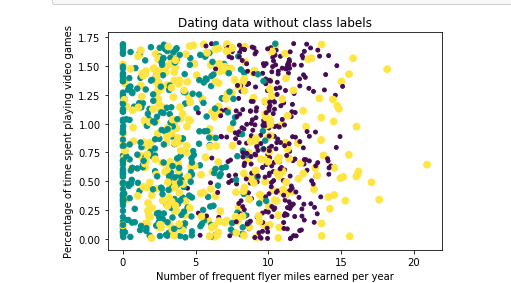

# KNN: Tell me what you like, and I will tell you what you really want

## 1. Synopsis

The people we surround ourselves with help set the baseline for what we think is ok, what we think is possible and what we’re exposed to. Who you spend time with, determine in many ways, the path you end up taking. So we have to make hard decisions on a regular basis about who we say yes to and which relationships we invest in.

Online dating is really popular. A survey conducted in 2013 found that 77% of people considered it "very important" to have their smartphones with them at all times. With the rise and rise of apps like Tinder, who could blame them. Online dating or internet dating is a considered as a system that enables people to find and introduce themselves to new personal connections over the internet, usually with the goal of developing personal, romantic, or sexual relationships.

## 2. Motivation
In this project, I will use KNN(k-Nearest Neighbors) on an online dating dataset to predict if Casandra really likes a guy base on the information she will provide. I think KNN is a very powerful algorithm for classification. On the other hand, I choose a project on Online dating because I have never been in an online dating site before, I really want to understand why it is so popular and why people find themselves dating online.

## 3. Files structure
- **data/:**    This is a folder which has the dataset `datingTestSet.txt` for this project
- **images/:**   This folder content all images used in this project
- **KNN.ipynb:** This file is where my code resides.
- **README.md:** You are looking at this file. 

## 4. Libraries used:
- Keras: A API for different libraries to build Deep Learning model
- Numpy: A library for mathematics operations 
- Matplotlib: A plotting library for the Python programming language

## 5. Summary
Casandra was able to gather a lot of information from the online dating site she has been visiting for the past few years. She wanted a system which could use this information and easily predict her interest on a guy base on the information she will provide about the guy.

Here data has 3 features she was interested about guys 
- Number of frequent flyer miles earned per year
- Percentage of time spent playing video games
- Liters of ice cream consumed per week

With the help of a scatter plot, we I was able to analyse the data. It was easy to identify the different classes, but it was difficult to draw conclusions from looking at this plot.

Using the data provided by Casandra, I was able to create the system she wanted. The system received numeric values for each features she indicated and the system uses KNN classification to predict if she will like the guy in either small dose, large dose or not at all.

The KNN algorithm was trained on her data and had a total error rate of **2%**, which is not bad.

